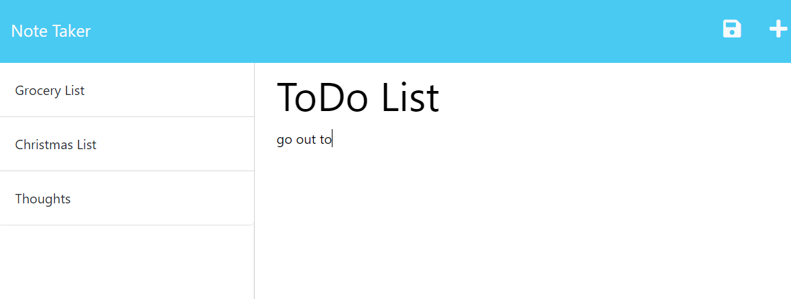

# Note Taker

## Description

This server-powered application lets you take notes with ease! Start writing your note title and text content and save your note. You can select it to see it again at any time!

## Table of Contents

- [Installation](#installation)
- [Usage](#usage)
- [Contributing](#contributing)
- [Tests](#tests)
- [Questions](#questions)

## Installation

Install required packages with: npm i

## Usage

Use this application as directed in the website.

[Deployed Application](https://note-taker-redeploy.herokuapp.com/)

## Contributing

Changes to this code are not covered under any license.

## Tests

There is no built-in testing for this application.

## Questions

GitHub Username: rjschroeder

GitHub Profile: [Click Here](https://github.com/rjschroeder)

Feel free to email me with any questions you may have at my email below:

Email: are.jay.schroeder@gmail.com

